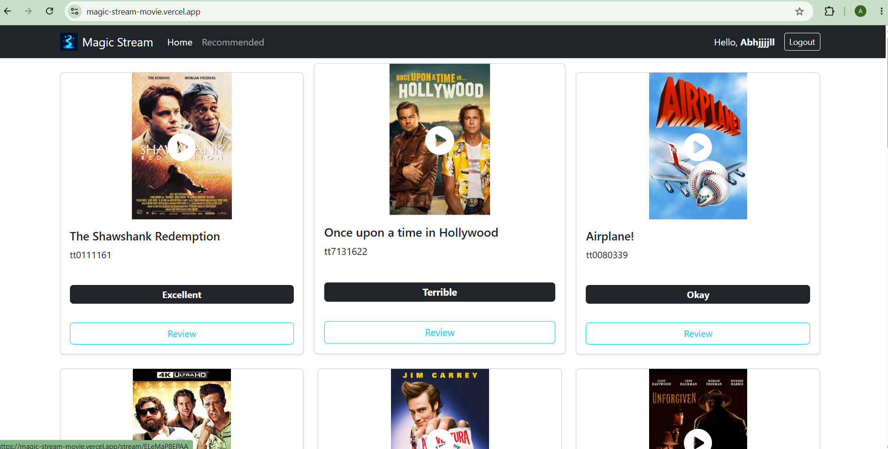
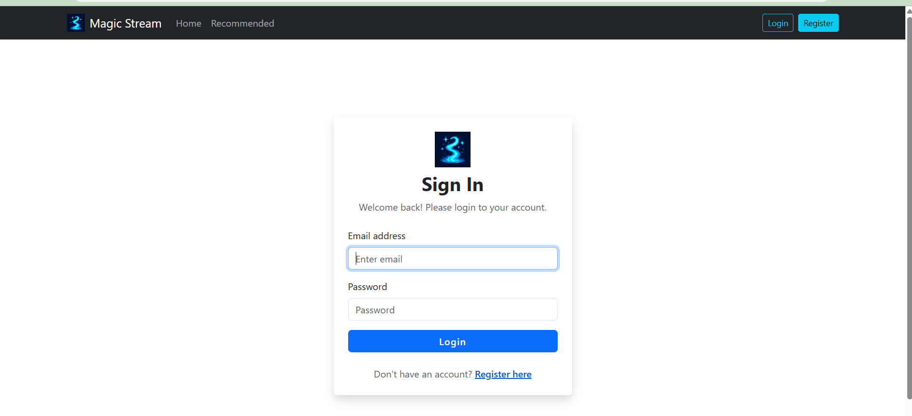
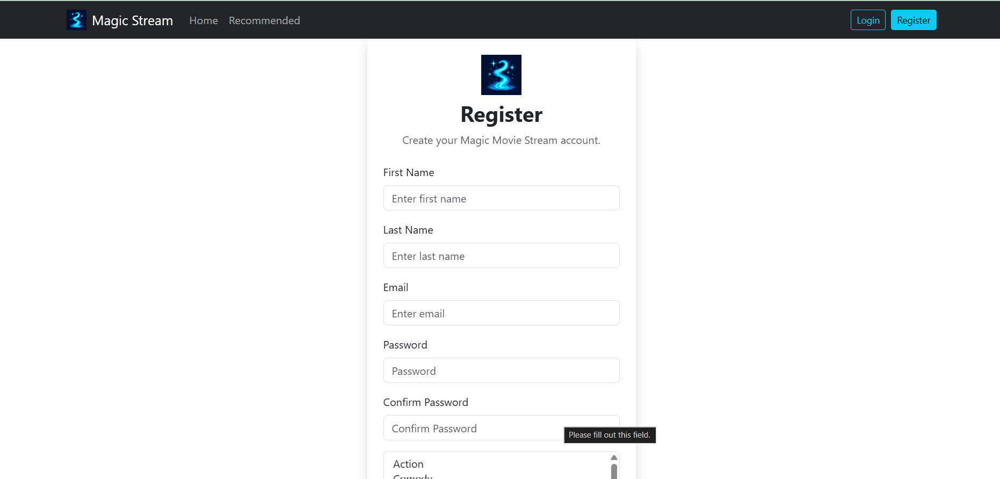

# MagicStream 🎬✨

Movie streaming platform with AI recommendation built with modern web technologies (React/Go/gin-gonic/MongoDB) 

---

## About  

This project is a full-stack simulation of a modern **Movie Streaming Platform**, designed to showcase how different technologies can be combined to deliver a scalable, AI-powered application.  

The system brings together a **React-based frontend** for an engaging user experience, a **Go-based backend** for high-performance API services that runs on the gin (gin-gonic) web framework, and an **AI-powered recommendation engine** to personalize movie suggestions using **LangChainGo** and **OpenAI**.  

It also demonstrates how **MongoDB** can serve as a reliable, scalable database solution for managing media metadata and user preferences.  

---

## Features

- Movie Streaming service simulated on the front end using React and React-Player
- Web API service written using GO and runs on the gin-gonic web framework 
- AI Recommendation service using LangChainGo, Go and OpenAI
- Scalable backend storage provided by MongoDB

---

## Tech Stack

| Frontend / Client | JavaScript / React |
| Backend / Server | Go / gin-gonic |
| Storage / Database | MongoDB |
 
---

---

### Installation

1. Clone the repo  
   ```bash
   git clone git@github.com:abhi2J4/MagicStream_Movie.git
   cd MagicStream_Movie

# 🎬 MagicStream — Movie Streaming Web App

A full stack movie streaming platform built with React.js and Go.

🌐 **Live Demo:** [https://magic-stream-movie.vercel.app](https://magic-stream-movie.vercel.app)

---

## 📸 Screenshots
#Home Page
<p align="center">
  
  
  
  
</p>

## 🛠️ Tech Stack

| Layer | Technology |
|---|---|
| Frontend | React.js, Vite, Bootstrap |
| Backend | Go, Gin Framework |
| Database | MongoDB, MongoDB Atlas |
| Auth | JWT, HttpOnly Cookies |
| Deployment | Vercel (Frontend), Render (Backend) |

---

## ✨ Features

- 🎥 Browse and stream movie trailers
- 🔐 User registration and login with JWT authentication
- 🍪 Secure HttpOnly cookie-based token management
- 🔄 Access and refresh token rotation
- ⭐ Movie reviews and rankings
- 🎭 Genre-based movie filtering
- 📱 Responsive design

---

## 🚀 Getting Started

### Prerequisites
- Node.js
- Go 1.21+
- MongoDB

### Frontend Setup
```bash
cd Client/magic-stream-client
npm install
npm run dev
```

### Backend Setup
```bash
cd Server/MagicStreamServer
cp .env.example .env
# Add your MongoDB URI and other env vars
go run main.go
```

### Environment Variables

**Backend (.env)**
DATABASE_NAME=magicstream
MONGODB_URI=mongodb://localhost:27017/
SECRET_KEY=your_secret_key
SECRET_REFRESH_KEY=your_refresh_secret_key
BASE_PROMPT_TEMPLATE=Return a response using one of these words: {rankings}. The response should be a ...
OPENAI_API_KEY=[REDACTED]
RECOMMENDED_MOVIE_LIMIT= 5
ALLOWED_ORIGINS=http://localhost:3000,http://localhost:5173,http://localhost:8080
